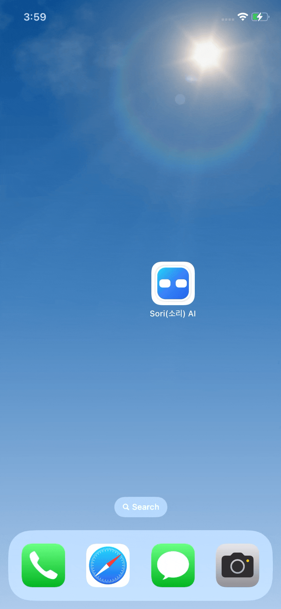
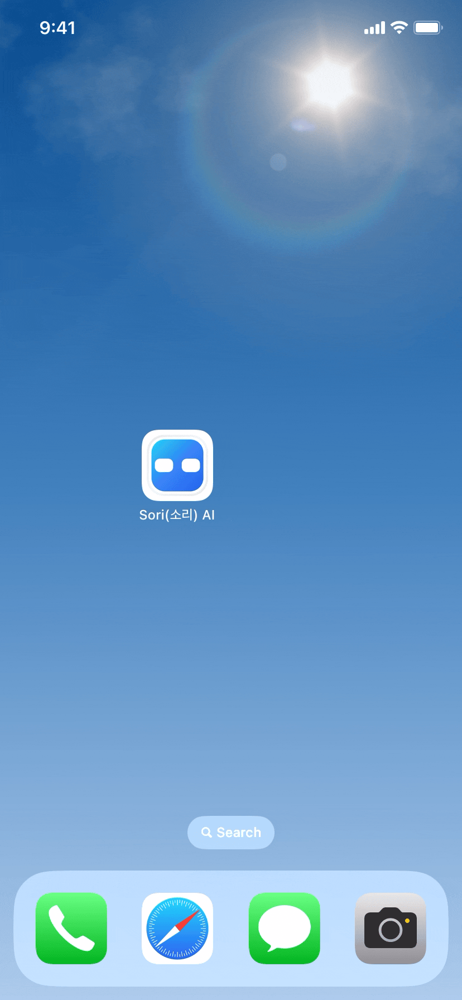
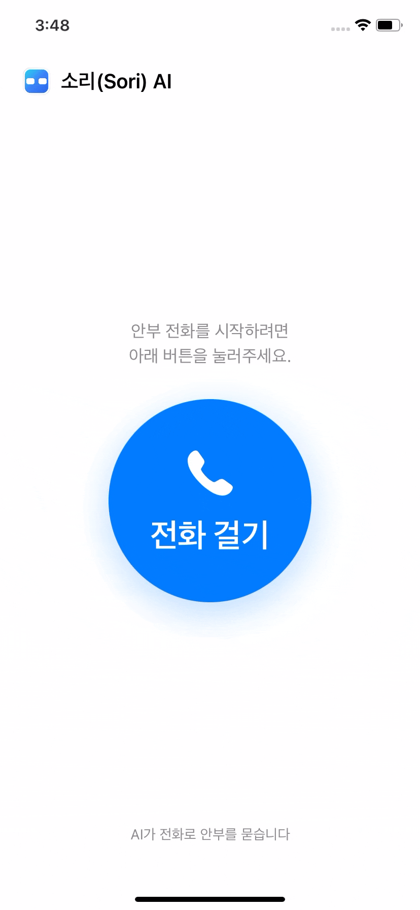
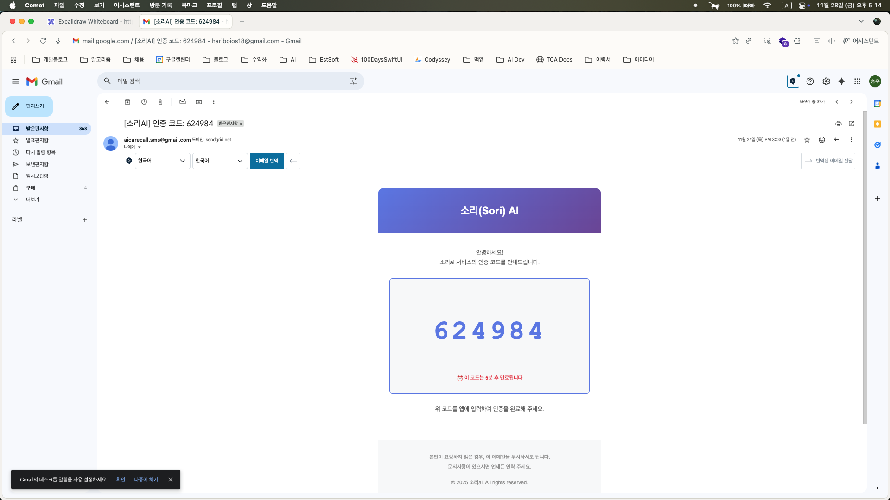
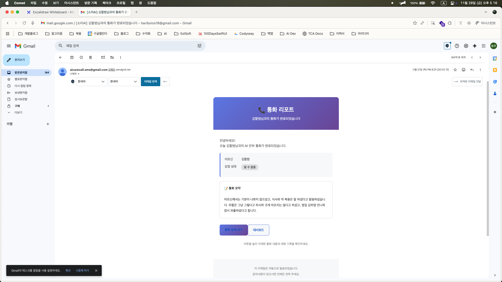

# Sori(소리) AI

> AI가 매일 어르신께 전화를 걸어 안부를 묻고, 보호자에게 리포트로 전달하는 케어 서비스

## 목차

- [📋 개요](#-개요)
- [👥 팀원](#-팀원)
- [🔗 링크들](#-링크들)
- [💡 소개](#-소개)
- [🛠️ 기술 스택](#️-기술-스택)
- [🔄 서비스 주요 플로우](#-서비스-주요-플로우)
- [🏗️ 시스템 아키텍처](#️-시스템-아키텍처)

## 📋 개요

- **개발 기간**: 11/10(월) - 11/28(금) (약 3주)
- **프로젝트 규모**: 풀스택 3개 플랫폼 (iOS + Web + Server)
- **팀 구성**: 4명 (프론트엔드, 백엔드, iOS, 풀스택)
- **주최**: 이노베이션 아카데미 - Codyssey

## 👥 팀원

<table>
<tr>
<td align="center" width="25%">
<a href="https://github.com/jaylovegood">
 
<b>@jaylovegood</b>
</a>
</td>
<td align="center" width="25%">
<a href="https://github.com/stevenkim18">
 
<b>@stevenkim18</b>
</a>
</td>
<td align="center" width="25%">
<a href="https://github.com/newcode99">
 
<b>@newcode99</b>
</a>
</td>
<td align="center" width="25%">
<a href="https://github.com/x0cloud69">
 
<b>@x0cloud69</b>
</a>
</td>
</tr>
</table>

## 🔗 링크들

| 🌐 서비스         | 설명                                             | URL                                                                  | 배포                                                                                                   |
| ----------------- | ------------------------------------------------ | -------------------------------------------------------------------- | ------------------------------------------------------------------------------------------------------ |
| **Web Dashboard** | 보호자용 대시보드 (통화 리포트, 통계, 일정 관리) | [sori-ai.vercel.app](https://sori-ai.vercel.app/)                    |     |
| **API Server**    | FastAPI 기반 백엔드 (Swagger 문서)               | [API Docs](https://aicarecall-server-production.up.railway.app/docs) |  |

---

> [!NOTE]
> 📱 **iOS 앱 배포 상태**
>
> iOS 앱은 애플 앱스토어 심사 절차가 진행 중입니다. 심사 승인 후 곧 다운로드 가능하도록 준비하고 있습니다!
>
> 테스트하고 싶으신 분은 아래 Github 소스 코드를 다운 받아 Xcode에서 실행하실 수 있습니다.

| 📦 Repository | 주요 기술 스택                   | 설명                                      | 링크                                                          |
| ------------- | -------------------------------- | ----------------------------------------- | ------------------------------------------------------------- |
| **Web**       | Next.js, TypeScript, TailwindCss | 보호자용 웹 대시보드 프론트엔드           | [GitHub](https://github.com/codyssey-PRISM/AICareCall-web)    |
| **Server**    | FastAPI, PostgreSQL, APScheduler | AI 통화 스케줄링 및 APNs 푸시 백엔드      | [GitHub](https://github.com/codyssey-PRISM/AICareCall-server) |
| **iOS**       | Swift, SwiftUI, TCA              | 어르신용 AI 통화 iOS 앱 (CallKit/PushKit) | [GitHub](https://github.com/codyssey-PRISM/AICareCall-mobile) |

---

> [!IMPORTANT]
> 💡 **각 플랫폼의 전체 소스 코드는 위의 GitHub Repository 링크를 통해 확인하실 수 있습니다!**
>
> 현재 레포지토리는 전체 프로젝트의 문서화 및 아키텍처 설명을 위한 메인 README입니다.

## 💡 소개

### 배경

1인 가구 및 노년층 인구가 증가하면서 **독거 어르신의 안부 확인**이 중요한 사회적 과제가 되었습니다. 하지만 자녀와 보호자들은 바쁜 일상 속에서 매일 전화를 드리기 어렵고, 갑작스러운 이상 상황을 즉시 파악하기 어려운 현실입니다.

기존의 안부 확인 솔루션은 단순 문자나 알림 정도에 그치거나, 실제 통화 기반 서비스는 구현 난이도와 비용이 높아 접근성이 낮았습니다.

### 해결 방안

**Sori AI**는 이러한 문제를 해결하기 위해 다음과 같은 솔루션을 제공합니다:

- **전화라는 익숙한 UX 유지**: 어르신들이 가장 익숙한 전화 통화 방식 활용
- **AI가 대신하는 일상적 안부 전화**: 보호자를 대신해 매일 정해진 시간에 AI가 자동으로 전화를 걸어 대화
- **실시간 리포트 제공**: 통화 내용을 자동으로 요약하고 감정 분석하여 보호자에게 웹 대시보드로 제공
- **이상 징후 조기 발견**: 평소와 다른 패턴이나 감정 상태 변화를 감지하여 보호자에게 알림

### 핵심 가치

- **보호자**: "오늘도 부모님이 잘 계신다"는 안심을 한눈에 확인
- **어르신**: 매일 정해진 시간에 "누군가 나를 챙겨준다"는 따뜻한 경험
- **사회**: 독거 어르신의 고독사 예방과 웰빙 향상에 기여

---

## 🛠️ 기술 스택

| 플랫폼     | 카테고리     | 기술 스택               | 설명                                  |
| ---------- | ------------ | ----------------------- | ------------------------------------- |
| **Web**    | 프레임워크   | Next.js / React         | 최신 App Router 기반 SSR              |
|            | 언어         | TypeScript              | 타입 안정성                           |
|            | 스타일링     | Tailwind CSS + Shadcn   | 유틸리티 퍼스트 CSS + 재사용 컴포넌트 |
|            | 상태 관리    | Zustand                 | 경량 전역 상태 관리                   |
| **Server** | 프레임워크   | Python / FastAPI        | 비동기 고성능 API 서버                |
|            | 데이터베이스 | SQLAlchemy + PostgreSQL | 비동기 ORM + 관계형 DB                |
|            | 푸시 알림    | APNs (HTTP/2)           | iOS VoIP 푸시                         |
|            | 스케줄러     | APScheduler             | 자동 통화 예약 시스템                 |
|            | AI 음성      | Vapi Server SDK         | AI 음성 통화 연동                     |
|            | 이메일       | SendGrid                | 인증 코드 발송                        |
| **iOS**    | 프레임워크   | Swift / SwiftUI         | 네이티브 iOS 개발                     |
|            | 아키텍처     | TCA                     | The Composable Architecture (단방향)  |
|            | 통화 시스템  | CallKit / PushKit       | 시스템 전화 UI + VoIP 푸시 수신       |
|            | AI 음성      | Vapi iOS SDK            | AI 음성 통화 클라이언트               |
|            | 의존성 관리  | swift-dependencies      | 테스트 가능한 의존성 주입             |

---

## 🔄 서비스 주요 플로우

### 1. (보호자) 온보딩 화면

### 2. (보호자) 보호자 + 어르신 정보 입력 및 신청

### 3. (어르신) iOS앱 초대 코드 입력

### 4. (어르신) 백엔드(스케줄러) 푸시 알림 발송 -> 통화 수락

### 5. (보호자) 통화 종료 후 보호자 이메일로 리포트 전송 -> 대시보드

### 6. 기타

#### 어르신 직접 통화 시도

#### 보호자 이메일 초대코드

#### 보호자 이메일 리포트

## 🏗️ 시스템 아키텍처

Sori AI는 **3개의 독립적인 플랫폼**이 유기적으로 연결된 풀스택 시스템입니다.

- 웹(보호자), iOS(어르신) 클라이언트가 같은 백엔드 API 사용
- AI 통화 에이전트는 **VAPI.ai**를 사용
  - iOS에서 VAPI SDK를 사용해서 통화를 연결.
  - 백엔드에서는 **WebHook**으로 Vapi 서버에서 통화 내용을 실시간으로 받음.
- 백엔드에서 **APNS 서버**로 푸시 전송 요청
  - 초대코드 입력 성공 후, 백엔드 전송된 iOS 디바이스ID를 통해 푸시 전송.
- iOS에서는 **PushKit**을 통해서 통화 알림을 받고 **CallKit**을 통해서 실제 전화와 같은 UI/UX를 제공합.
- Vapi.ai는 대화 외부 LLM 모델과 외부 음성 모델을 선택할 수 있음.
  - 통화과 끝나면 정해진 프롬프트로 요약, 태그 추출, 분석 등이 가능함.

---
